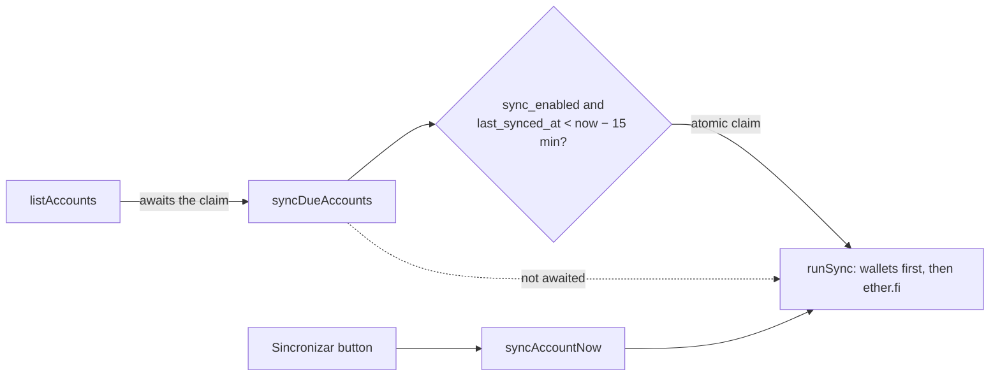

# Crypto account sync

How on-chain movements of the user's crypto accounts become `transaction` rows. The design and the decisions behind it are in [`superpowers/specs/2026-09-24-crypto-sync-design.md`](superpowers/specs/2026-09-24-crypto-sync-design.md). This page covers how the shipped code behaves.

## Accounts

An account is a crypto account when `wallet_address` is set. `sync_kind` picks what gets read:

| `sync_kind` | Meant for | Chain read | Sources |
|---|---|---|---|
| `wallet` | Safe (salary in USDC, savings) | Base (8453) | USDC/USDT `Transfer`s from and to the address |
| `etherfi_cash` | ether.fi Cash card (debit mode) | OP (10) | USDC/USDT `Transfer`s + ether.fi `Spend` logs |

The ether.fi Base deposit leg is not read. ether.fi bridges every Base deposit to the OP safe (same address on every chain), where it arrives from `TopUpDest`. Reading both would count one deposit twice.

Other account columns:
- `sync_enabled`: sync on read.
- `sync_since`: backfill start date.
- `sync_cursor`: `{ "<chainid>": lastProcessedBlock }`.
- `last_synced_at`, `last_sync_error`: what the UI shows.

## When it runs

- **On read:** `listAccounts` awaits `syncDueAccounts`, which only claims the due accounts and starts `runSync` without waiting. Accounts in a run come back with `syncing: true` (an in-process `Set`, one instance only). The Contas page spins the Sincronizar button and polls every 2 s until it clears, then refreshes transactions and faturas.
- **Throttle and lock:** an atomic `UPDATE … WHERE last_synced_at < now − 15 min` claims each account's slot. This throttles every 15 min, including after failures, and stops concurrent reads from fetching the same account twice.
- **Manual button:** `syncAccountNow` runs right away, even with auto-sync off.
- **Order:** a run that includes an ether.fi card first syncs the user's auto-synced wallets. The card's top-up dedupe needs the Safe's `transfer` row to exist already. If a wallet fails, the card is skipped and gets an error.

## Per account

1. For each chain: read the head, then set `toBlock = head − 150`, which leaves the indexer about 5 minutes. `fromBlock` is `cursor + 1`, or the block at `sync_since` on the first run.
2. Fetch from Blockscout:
   - Stablecoin transfers come from REST `/api/v2/addresses/{addr}/token-transfers?token=…`. The endpoint is indexed by address, returns `log_index`, and pages from newest to oldest down to `fromBlock`, capped at 40 pages.
   - `Spend` logs come from `getLogs` on the `CashEventEmitter` (`0x380b2e96799405be6e3d965f4044099891881acb`) with `topic1 = safe`.
3. Drop events whose `external_id` already exists. Re-reads are then idempotent and can never claim a second row.
4. Fetch the BCB PTAX (venda) for the event dates.
5. Plan the rows with `planSync` in `src/lib/chain-sync.ts`. It is pure and unit-tested.
6. In one db transaction:
   - insert the new rows (`ON CONFLICT (user_id, external_id) DO NOTHING`);
   - claim the matched rows;
   - advance the cursor and clear the error. This last write only happens while the account config is still the one the run started with.

Any failure aborts that account: no rows are written, the cursor stays put, and `last_sync_error` is set. `syncDueAccounts` never throws into `listAccounts`.

## Mapping rules (`planSync`)

Skipped before any rule:
- tokens outside the allowlist;
- zero-value transfers (address poisoning);
- self-transfers;
- events dated before `sync_since`;
- moves to or from ether.fi Lend (`LendGateway`), because lent funds stay part of the card balance.

| Event | Row |
|---|---|
| Incoming transfer | `earn`. Skipped if it comes from a sibling crypto account that syncs this chain (the sibling records the transfer), or if it is the arrival of a recorded transfer into this account (±1 day, ±1%; one transfer absorbs one arrival). |
| Incoming from ether.fi `refundWallet` / `CashbackDispatcher` | `earn` with note `ether.fi Cash (reembolso)` / `ether.fi Cash (cashback)` |
| Outgoing in the same tx as a `Spend` | skipped (settlement leg) |
| Outgoing to a sibling crypto account | `transfer` (`account_id` = this, `counter_account_id` = sibling) |
| Other outgoing | `expend` |
| ether.fi `Spend` | `expend` of `totalUsdAmt`, note `ether.fi Cash` |

Money:
- USD cents are `round(raw / 10⁴)`, since the tokens have 6 decimals.
- `amount` is `round(usd_cents × PTAX)` in BRL cents. It uses the PTAX of the tx date, or of the last business day before it (weekends, holidays, or today before the ~13h bulletin).
- Both values go through `assertMoney`.
- `usd_amount` keeps the USD cents.
- The balance is "historical BRL": the sum of the rows, not today's USD balance times today's rate.

## Matching hermes/manual rows

Before inserting a synced `earn`/`expend`, the planner looks for a row that:
- has `external_id IS NULL`;
- belongs to the same account;
- has the same type;
- is dated within ±2 days;
- has an amount within ±3% of the converted value.

The closest amount wins, then the closest date. A match gets `external_id` and `usd_amount` set, and it keeps its own amount, note and tags. Matching only happens at sync time, so a hermes row posted after the sync imported the same movement is a duplicate.

## Rows and ids

- `external_id` is `<chainid>:<txhash>:<logIndex>`, with `UNIQUE(user_id, external_id)`.
- A synced row the user deletes is not re-created, because the cursor has moved past it.
- Editing the address, kind or `sync_since` resets the cursor, and the backfill starts again from `sync_since`. That re-read skips rows that still exist, but brings back rows the user deleted.

## Configuration

- `BLOCKSCOUT_API_KEY`: a free Blockscout PRO key from dev.blockscout.com (5 req/s, 100k credits/day, covers Base and OP).
  - Without it, sync falls back to the keyless public explorers, which allow about 10 RPC requests per hour. That is for local dev only.
  - Etherscan V2 is not an option on the free tier, which refuses Base and OP.
- In the UI (Contas → Sincronização cripto): wallet address, origin (Carteira (Base) / ether.fi Cash (OP)), start date, and the automatic sync toggle.

## Troubleshooting

| `last_sync_error` | Meaning / fix |
|---|---|
| `explorer <chain> …: HTTP 401/402` | Missing or invalid `BLOCKSCOUT_API_KEY` |
| `… HTTP 429` | Rate limited; next slot retries |
| `over 40 pages of … transfers` | Address too busy for one run; pick a later start date |
| `No PTAX rate on or before …` | BCB returned nothing for 10 days before the date |
| `The operation was aborted due to timeout` | Explorer slower than 30 s (seen on Base USDT scans of empty addresses) |
| `Carteira vinculada falhou …` | The Safe failed in this run; the card waits for the next one |

## Code

| File | Role |
|---|---|
| `src/lib/chain-sync.ts` | Pure: allowlists, log parsing, PTAX lookup, `planSync` (mapping, top-up dedupe, matching) |
| `src/lib/chain-sync.test.ts` | Unit tests, including a real OP `Spend` log |
| `src/server/chain-sync.core.ts` | Server-only: Blockscout + PTAX fetch, db writes, throttle, `syncDueAccounts`, `syncAccountNowCore` |
| `src/server/accounts.ts` | `syncAccountNow` server fn |
| `src/server/accounts.core.ts` | Sync config on create/update. An omitted `walletAddress` keeps the config, `null` clears it, and any change resets the cursor. |
| `src/routes/_authed/accounts.tsx` | Form section and account card (status, button, error) |
